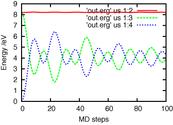
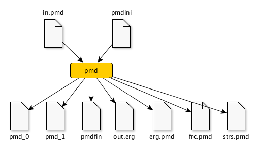

# Run pmd

## Run a sample simulation

There are some input files in `example/test-W/` directory. ( `in.pmd`
and `pmdini` ) These input files are for the system of BCC tungsten
crystalline structure including one helium atom.

    $ cd example/test-W
    $ ../../pmd/pmd

When you run the *pmd* command like above, *NVE* -MD simulation of 100
steps is performed. And the total, kinetic, and potential energies are
output in `out.erg` file. So you can look at the evoluation of these
energies using `gnuplot` command as,

    $ gnuplot
    gnuplot> plot 'out.erg' us 1:3 w l, 'out.erg' us 1:4 w l, 'out.erg' us 1:5 w l

In this case, since you are performing *NVE* -MD simulation of bcc-W,
the total energy conserves conpensating the deviations of kinetic and
potential energies.

!!! Note
    The format ot `out.erg` is a bit changed from that of before 2018-11-01
    versions. The total and potential energies are raw values not being
    subtracted the initial values.

And also configurations of atoms at each 10 steps out of 100 steps are
written in LAMMPS-dump format, *e.g.*, `dump_0`, `dump_10`,\...,
`dump_100`.

------------------------------------------------------------------------

## Input files needed to run pmd

To run *pmd*, the following files are required in the working directory,

- `in.pmd` -- Input file that describes simulation setting.
- `pmdini` -- Cell information and initial positions and velocities of atoms.

And there are some optional files required by the *pmd* if you use
interatomic potentials that require input parameters from files such as
`in.params.xxx`.

After running *pmd* , some output files appear in the same directory.

------------------------------------------------------------------------

## Units used in pmd

- Length: Angstrom
- Time: femto second (fs)
- Energy: electron volt (eV)
- Mass: 1/12 of carbon atom

------------------------------------------------------------------------

## Make an initial atom-configuration file

Please [Atom-configuration file](pmd-file.md) for detail.

One has to make an initial atom-configuration file, `pmdini`, to run
*pmd*. There are already some programs that make initial
atom-configuration files of some systems (`mkconf/mkconf_????.F` and/or
`nappy/mkcell/cell_maker.py`). You can make your own initial
atom-configuration file by looking at those program codes.

If there is already a program that makes an atom-configuration file of
your target system, you can make an atom-configuration file as,

    $ cd mkconf
    $ emacs makefile
    (find which mkconf_* will be made)
    $ make mkconf_Si_disl
    $ ./mkconf_Si_disl

or you can use `nappy/mkcell/cell_maker.py` as well,

    $ python /path/to/nappy/mkcell/cell_maker.py -h
    ...
    $ python /path/to/nappy/mkcell/cell_maker.py dia -l 5.427 -s 4,4,4

Then you get an atom-configuration file `pmdini`.

!!! Note
    If you have to make the program which makes an atom-configuration file,
    copy any program like `mkconf_BCC.F` , modify it, add an entry into
    `makefile` , and compile.

------------------------------------------------------------------------

## Make the in.pmd file

Please refer `in-pmd`{.interpreted-text role="ref"} for details of
`in.pmd` file.

For instance, `in.pmd` file for the system of 1000 step MD simulation
using `SW_Si` potential is as follows,

    #
    #  unit of time  = femto sec
    #  unit of length= Angstrom
    #  unit of mass  = unified atomic mass unit
    #

    io_format         ascii
    print_level       1

    time_interval     2d0
    num_iteration     1000
    num_out_energy    100

    flag_out_pmd      1
    num_out_pmd       10

    force_type        SW_Si
    cutoff_radius     3.7712d0
    cutoff_buffer     0.2d0

    flag_damping      2
    damping_coeff     0.5d0
    converge_eps      1d-4
    converge_num      3

    initial_temperature     -2000d0
    final_temperature     -2000d0
    temperature_control     none
    temperature_target      100d0
    temperature_relax_time  1d0

    factor_direction 3 2
      1.000d0  1.000d0  1.000d0
      1.000d0  0.000d0  1.000d0

    stress_control       none
    stress_relax_time   100d0
    stress_target
      0.00d0   0.00d0   0.00d0
      0.00d0   0.00d0   0.00d0
      0.00d0   0.00d0   0.00d0
    pressure_target     1.00

    shear_stress   0.00

Here, the lines begin with `!` or `#` are treated as comment lines and
blanc lines are skipped.

------------------------------------------------------------------------

## Run pmd

### Run pmd on 1-process

It is really easy to run *pmd* on 1-process. On the directory where
`in.pmd` and `pmdini` exist, just execute *pmd* as,

    $ /path/to/pmd/pmd

If you want to perform it background,

    $ /path/to/pmd/pmd > out.pmd 2>&1 &

The following files appear when you perform *pmd*,

- `out.erg` -- Total, kinetic, potential energies, and temperature,
    volume, pressure.
- `dump_##` -- Atom-configurations at a certain MD step is written in
    LAMMPS-dump format by default. `##` means the MD step.

### Run pmd on parallel-nodes

Different from the old version of *pmd* which requires divided atom
configuration files for parallel nodes, in the current version (since
2016-05-05), the parallel simulation can be performed almost the same as
the serial run.

Just you need to describe how many divisions on each direction in
`in.pmd` such as `num_nodes_x`, `num_nodes_y` and `num_nodes_z` ,and run
*pmd* with `mpirun` or `mpiexec` command to run MPI executable.

    $ mpirun -np 8 /path/to/pmd > out.pmd 2>&1 &

Here, *pmd* will be executed on 8-nodes and the standard output is
written into `out.pmd` .

If any job-scheduling system is available on the system you are using,
describe the above command in your job script to be submitted.

------------------------------------------------------------------------

## Notes on performing massively parallel simulation

When you perform parallel simulation with over one million atoms, the
data of atom-configuration files becomes considerably large and
reading/writing data takes long time compared with intrinsic
computation. So *pmd* can read/write binary version of
atom-configuration files that are way more small amount of data. If you
want to read/write binary files, describe following in `in.pmd`,

    io_format   binary

And also you have to write code of writing binary atom-configuration
file in `mkconf_*.F`. In `mkconf_*.F` files, there is a line of
subroutine call `call write_pmd0_ascii` , you have replace it to
`call write_pmd0_bin` and recompile the program.
